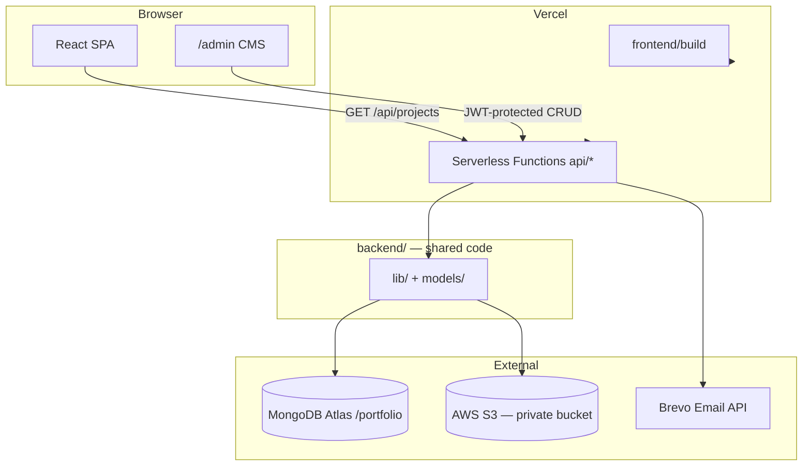

# Portfolio Architecture

This document explains how the monorepo is organized and how the pieces work together.

## Repository layout

```
react-portfolio-template/
├── frontend/                 # React (CRA) single-page app
│   ├── public/               # Favicons, SEO, legacy project images (GitSol, TaskMaster)
│   ├── src/                  # Components, styles, setupProxy.js
│   ├── package.json
│   └── tsconfig.json
│
├── api/                      # Vercel serverless route handlers (DEPLOYED)
│   ├── projects/             # Project CRUD + image upload
│   ├── expertise/            # Skills CMS
│   ├── timeline/             # Career history CMS
│   ├── resume/               # PDF resume (GET + upload)
│   ├── profile-photo/        # Profile photo (GET + upload)
│   ├── auth/login.ts
│   ├── contact.ts
│   └── health.ts
│
├── backend/                  # Shared server code + local dev (NOT deployed alone)
│   ├── lib/                  # auth, db, s3, validators, timeline-order, projects
│   ├── models/               # Mongoose schemas (Project, Expertise, Timeline, Resume, ProfilePhoto)
│   ├── scripts/dev-server.ts # Local API on port 3001
│   ├── .env                  # Local secrets (gitignored)
│   ├── .env.example
│   ├── package.json          # Local dev deps (tsx, dotenv)
│   └── tsconfig.json
│
├── docs/
├── package.json              # Root deps — used by Vercel to bundle api/ functions
├── vercel.json               # Build, rewrites, function config
└── README.md
```

### Why two folders: `api/` and `backend/`?

Vercel **only deploys serverless functions from a root `/api` directory**. Business logic does not belong mixed into route files.

| Folder | Purpose | Deployed? |
|--------|---------|-----------|
| `api/` | Thin handlers: parse request → call lib → return response | **Yes** |
| `backend/` | Reusable logic, DB models, local dev server | **No** (imported by `api/`) |

Example import in a handler:

```typescript
// api/projects/index.ts
import { connectDB } from '../../backend/lib/db';
import Project from '../../backend/models/Project';
```

## High-level flow



## Local vs production routing

| Environment | How `/api/*` works |
|-------------|-------------------|
| **Local dev** | CRA `setupProxy.js` forwards `/api/*` → `http://localhost:3001` (backend dev server loads handlers from `api/`) |
| **Production** | Same origin — Vercel serves `api/*.ts` as serverless functions |

No `REACT_APP_API_URL` is needed in production.

## Serverless design

Each file under `api/` exports a default `handler(req, res)` compatible with `@vercel/node`:

- **Cold-start friendly** — only one route's code loads per request
- **No long-running server** on Vercel
- **Clear split** — public routes vs JWT-protected admin routes

Local development uses `backend/scripts/dev-server.ts` instead of Vercel CLI (avoids recursive `vercel dev` issues).

## Authentication

| Concern | Implementation |
|---------|----------------|
| Admin credentials | `ADMIN_USERNAME` + `ADMIN_PASSWORD` env vars |
| Login | `POST /api/auth/login` → JWT |
| Protected routes | `Authorization: Bearer <token>` header |
| Token storage | `localStorage.adminToken` in the browser |
| Validation | Zod schemas in `backend/lib/validators.ts` |

Protected: all `POST`/`PUT`/`DELETE`/`PATCH` CMS routes, file uploads.

## Data layer

- **Database:** MongoDB Atlas, database name `portfolio`
- **Collections:** projects, expertise, timelines, resumes, profilephotos (Mongoose models)
- **Connection caching:** `backend/lib/db.ts` reuses Mongoose on warm invocations
- **Seed fallback:** `GET /api/projects` returns hardcoded seed data if DB is unreachable

## S3 storage (private bucket)

All uploads use presigned URLs — nothing is public-read on the bucket.

| Content | S3 prefix | CMS tab |
|---------|-----------|---------|
| Project images | `projects/` | Projects |
| Resume PDF | `resumes/portfolio-resume.pdf` | Resume |
| Profile photo | `profiles/portfolio-photo.{jpg\|png\|webp}` | Profile Photo |

Flow: upload → store S3 **key** in MongoDB → `GET` endpoints return presigned `imageUrl` / `previewUrl` / `downloadUrl`.

## Admin CMS tabs

| Tab | API |
|-----|-----|
| Projects | `/api/projects`, `/api/projects/upload` |
| Expertise | `/api/expertise` |
| Career History | `/api/timeline`, `/api/timeline/normalize` |
| Resume | `/api/resume`, `/api/resume/upload` |
| Profile Photo | `/api/profile-photo`, `/api/profile-photo/upload` |

## Contact form security

The Brevo API key lives **only** in server env vars. The React app calls `POST /api/contact` — the key never ships to the browser.

## Frontend routing

| URL | Purpose |
|-----|---------|
| `/` | Public portfolio |
| `/admin` | CMS login + content management |

Vercel rewrites non-`/api/*` paths to `index.html` for SPA support.

## Validation

Request bodies use **Zod** (not express-validator). Error format: `{ errors: [{ field, message }] }`.
