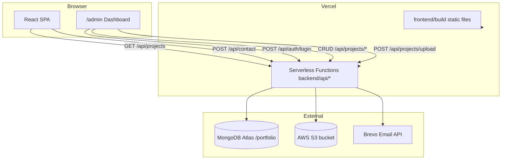

# Portfolio Architecture

This document explains how the portfolio monorepo is organized and how the pieces work together.

## Repository Layout

```
react-portfolio-template/
├── frontend/                 # React (CRA) single-page app
│   ├── public/               # Static assets (images, favicons, SEO files)
│   ├── src/                  # Components, styles, setupProxy.js
│   ├── package.json
│   └── tsconfig.json
│
├── backend/                  # Vercel serverless API (no Express server)
│   ├── api/                  # One file = one serverless function / route
│   ├── lib/                  # Shared server logic (auth, db, s3, validators)
│   ├── models/               # Mongoose schemas
│   ├── .env                  # Local secrets (gitignored — copy from .env.example)
│   ├── package.json
│   └── tsconfig.json
│
├── docs/                     # Documentation
├── vercel.json               # Vercel deploy config (must stay at root)
├── tsconfig.json             # Optional editor project references
├── README.md
└── LICENSE
```

**No root `package.json`.** Each app manages its own dependencies in `frontend/package.json` and `backend/package.json`. Vercel reads `vercel.json` at the root to build frontend and deploy API functions — that file is deploy config, not an npm package.

## High-Level Flow



## Why Serverless (Not Express)?

The previous attempt used a single Express app (`api/index.ts`) at the repo root. That pattern does **not** map cleanly to Vercel's serverless model.

The current backend uses **one TypeScript file per route** under `backend/api/`. Each file exports a default `handler(req, res)` function compatible with `@vercel/node`. Benefits:

- **Cold-start friendly** — only the code for one route loads per request
- **No long-running server** — scales automatically on Vercel
- **Clear separation** — public routes vs JWT-protected admin routes

## Authentication

| Concern | Implementation |
|---------|----------------|
| Admin credentials | `ADMIN_USERNAME` + `ADMIN_PASSWORD` env vars (single admin) |
| Login | `POST /api/auth/login` → returns JWT |
| Protected routes | `Authorization: Bearer <token>` header |
| Token storage | `localStorage.adminToken` in the browser |
| Validation | Zod schemas in `backend/lib/validators.ts` |

Protected endpoints: `POST /api/projects`, `PUT/DELETE /api/projects/:id`, `POST /api/projects/upload`.

## Data Layer

- **Database:** MongoDB Atlas, database name `portfolio`
- **Collection:** `projects` (Mongoose model `Project`)
- **Connection caching:** `backend/lib/db.ts` caches Mongoose on `global` to reuse TCP connections across warm invocations
- **Seed fallback:** If DB is unreachable, `GET /api/projects` returns hardcoded seed data so the site still renders

## Image Uploads

1. Admin selects a file in the dashboard
2. Frontend sends `multipart/form-data` to `POST /api/projects/upload`
3. Multer (memory storage) parses the file in the serverless function
4. `uploadToS3()` writes to `s3://<bucket>/projects/<timestamp>-<filename>`
5. Public URL is returned and saved in the project record

## Contact Form Security

The Brevo API key lives **only** in backend env vars. The React app calls `POST /api/contact`; it never sees the API key. This replaces the old pattern of `REACT_APP_BREVO_API_KEY` in the client bundle.

## Frontend Routing

| URL | Component | Purpose |
|-----|-----------|---------|
| `/` | Main portfolio sections | Public site |
| `/admin` | `Admin.tsx` | Login + project CRUD |

React Router handles client-side routing. Vercel rewrites all non-`/api/*` paths to `index.html` for SPA support.

## Validation Library

Request bodies are validated with **Zod** (not express-validator). Zod works without Express and fits the serverless handler pattern. Error responses use `{ field, message }[]` format.
